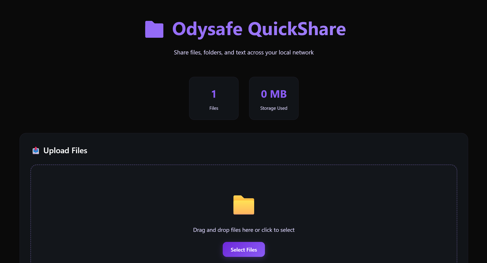

# 🗂️ ODYSAFE QuickShare - Local Network File Sharing Tool

**📁 Python File Server • 🖥️ Cross-Platform LAN Sharing • 🌐 Local Network Transfer**
**💾 Temporary File Storage • 🧹 Auto-Cleanup • 🔒 Secure Local Network**

Fast, secure local network file sharing and text sharing tool. Share files and text snippets across your LAN with zero configuration. Perfect for team collaboration, development workflows, and home networks. Built with Python for maximum compatibility.



---

## 📑 Table of Contents

- [Why ODYSAFE QuickShare?](#-why-odysafe-quickshare)
- [Quick Start](#-quick-start)
- [Features Overview](#-features-overview)
- [Usage Guide](#-usage-guide)
- [Network File Sharing](#-network-file-sharing)
- [Security & Privacy](#-security--privacy)
- [Configuration](#-configuration)
- [Troubleshooting](#-troubleshooting)
- [License](#-license)

---

## 🚀 Why ODYSAFE QuickShare?

### 🔥 Key Advantages

- 🗂️ **Simple File Sharing** : Share files and text snippets across your local network
- 📝 **Text Sharing** : Copy-paste text snippets with instant clipboard integration
- 📱 **QR Code Support** : Generate scannable QR codes for text content (no external dependencies)
- 💾 **Temporary Storage** : Automatic cleanup prevents storage accumulation
- 🖥️ **Multi-OS Support** : Works on Windows, Linux, and macOS
- ⚡ **Single Script** : No installation required, just run the Python script
- 🔒 **Network Security** : Local network only, no internet required
- 🚀 **Large File Support** : Upload files up to 1 GB
- 🆓 **100% Free & Open Source** : MIT licensed

### 🎯 Perfect For

- **Team Collaboration** : Instant file sharing between team members on local network
- **Development Teams** : Share code snippets, test files, and project assets
- **Office Environments** : Quick document and presentation sharing
- **Home Networks** : Family file sharing and media transfer
- **LAN File Transfer** : Fast, secure file exchange without cloud services
- **Network File Server** : Create temporary file server for multiple users

---

## ⚡ Quick Start

### Prerequisites

- Python 3.7 or higher installed on your system
- Local network access

### Running the Server

The Python script can run standalone without any installation. Simply execute it directly:

```bash
# Clone the repository
git clone https://github.com/Odysafe/QuickShare.git
cd QuickShare

# Run the server (default settings)
python quickshare.py
# On Windows, you may need to use: py quickshare.py
# On Linux/macOS, you can also use: python3 quickshare.py

# Or with custom options
python quickshare.py --port 8080 --cleanup-hours 12
```

> **Note:** The script creates a `shared_files/` directory automatically for temporary storage.

**Access the application:**
- Local: `http://localhost:8000`
- Network: `http://<YOUR_IP>:8000`

### Optional: Install as a System Service with HTTPS

If you want to run QuickShare as a background service with HTTPS support on Linux, you can use the installation script:

```bash
# Run the installation script as root
sudo ./install-service.sh
```

This will:
- Install QuickShare as a systemd service
- Generate a self-signed SSL certificate
- Configure the service to run on HTTPS (port 8443)
- Start the service automatically
- Enable auto-start on boot

**Service access:**
- Local: `https://localhost:8443`
- Network: `https://<YOUR_IP>:8443`

> **Note:** Your browser will show a security warning for the self-signed certificate. This is normal for local network use.

For more details, see [Service Installation Guide](SERVICE-INSTALLATION.md).

---

## ✅ Features Overview

| Feature | Description | Status |
|---------|-------------|--------|
| **File Upload** | Drag & drop multiple files (up to 1 GB) | ✅ Available |
| **Text Sharing** | Copy-paste text with clipboard integration | ✅ Available |
| **QR Code Generation** | Generate scannable QR codes for text content | ✅ Available |
| **File Download** | Download individual files | ✅ Available |
| **Text Copy** | One-click text copying to clipboard | ✅ Available |
| **Auto-Cleanup** | Automatic deletion after specified hours | ✅ Available |
| **Multi-OS Support** | Windows, Linux, macOS compatibility | ✅ Available |
| **Network Detection** | Auto-detection of local IP address | ✅ Available |
| **Web Interface** | Modern responsive web UI | ✅ Available |
| **Size Limits** | Configurable file size limits (default: 1 GB) | ✅ Available |
| **Error Handling** | Robust error handling and stability improvements | ✅ Available |

---

## 📖 Usage Guide

### Basic Usage

```bash
# Start LAN file server (default settings: port 8000, 24h cleanup)
python quickshare.py

# Custom port and cleanup time
python quickshare.py --port 8080 --cleanup-hours 12

# Limited file sizes for development
python quickshare.py --max-size 50
```

### Web Interface Features

#### File Upload & Sharing
- **Drag & Drop**: Drag files directly onto the drop zone for instant upload
- **Click to Select**: Click the drop zone to open file browser
- **Multiple Files**: Upload multiple files at once to LAN
- **Progress Feedback**: Visual upload progress indicator
- **File Size Limits**: Configurable maximum file sizes

#### Text Sharing & Clipboard
- **Paste Text**: Enter or paste text in the text area
- **One-Click Copy**: Copy shared text to clipboard instantly
- **Share Button**: Share text snippets with one click
- **Clipboard Integration**: Direct clipboard access for text sharing
- **QR Code Generation**: Generate scannable QR codes for text content - scan with your smartphone to copy text directly

#### File Management
- **Download Files**: Click Download button for any shared file
- **Copy Download URL**: Click "Copy URL" button to copy the direct download URL for use with wget or curl
- **Copy Text**: Click Copy button for text files
- **QR Code**: Click QR Code button for text files to generate a scannable QR code
- **Delete Files**: Remove files manually if needed
- **Auto-Expiry**: Files show automatic deletion time
- **Storage Stats**: Real-time storage usage display

### Command Line Options

```
--port PORT          Server port (default: 8000)
--host HOST          Host interface (default: 0.0.0.0)
--cleanup-hours HRS  Hours before auto-cleanup (default: 24)
--max-size SIZE      Max file size in MB (default: 1024)
--storage-dir DIR    Storage directory (default: ./shared_files)
--ssl-cert PATH      Path to SSL certificate file (enables HTTPS)
--ssl-key PATH       Path to SSL private key file (required if --ssl-cert is set)
```

**Popular Configurations:**

```bash
# Development mode (short cleanup, small files)
python quickshare.py --port 3000 --cleanup-hours 1 --max-size 10

# Office collaboration (extended retention)
python quickshare.py --port 8080 --cleanup-hours 168 --max-size 500

# Custom storage location
python quickshare.py --storage-dir /tmp/quickshare_data

# HTTPS mode (with your own SSL certificate)
python quickshare.py --port 8443 --ssl-cert /path/to/cert.pem --ssl-key /path/to/key.pem

# Or install as a system service with HTTPS (Linux only)
sudo ./install-service.sh
```

---

## 🏗️ Architecture

**Key Components:**
- **HTTP/HTTPS Server**: Built-in Python `http.server` with custom handlers and optional SSL/TLS support
- **File Storage**: Temporary storage with automatic cleanup
- **Web Interface**: Embedded HTML/CSS/JS interface
- **Network Detection**: Automatic local IP detection for cross-platform compatibility
- **System Service**: Optional systemd service integration for Linux (with installation script)

**Technology Stack:**
- **Python 3.7+**: Cross-platform compatibility (Windows, Linux, macOS)
- **HTTP Server**: Built-in Python `http.server` module with SSL support
- **File System**: Native OS file operations with pathlib
- **Web Interface**: Responsive HTML/CSS/JavaScript interface
- **QR Code Library**: Embedded qrcode.js library (no external dependencies)
- **Systemd**: Optional Linux service management (via installation script)

**Installation Options:**
- **Standalone Mode**: Run directly with `python quickshare.py` - no installation required, works immediately
- **Service Mode**: Install as systemd service with HTTPS using `install-service.sh` (Linux only) - runs in background with automatic startup

**Directory Structure:**
```
├── quickshare.py              # Main Python file server script (standalone)
├── install-service.sh         # Installation script for systemd service (Linux)
├── uninstall-service.sh       # Uninstallation script for systemd service
├── quickshare.service         # Systemd service file template
├── SERVICE-INSTALLATION.md    # Service installation guide
├── shared_files/              # Auto-created storage directory
│   ├── uploads/               # Uploaded files storage
│   └── .metadata/
│       ├── text_shares/       # Shared text files
│       └── files.json         # File metadata (original names)
└── README.md                  # This documentation
```

---

## 🔒 Security & Privacy

### Network Security

- **Local Network Only**: Server binds to local interfaces only, no internet exposure
- **No External Access**: Cannot be accessed from outside your network
- **File Sanitization**: All filenames are sanitized
- **Size Limits**: Configurable file size limits prevent abuse
- **Temporary Storage**: Files are automatically deleted

### Privacy Features

- **No Data Collection**: No telemetry or analytics
- **Local Processing**: All processing happens on your machine
- **No Accounts**: No user registration or authentication required
- **Clean Storage**: Automatic cleanup prevents data accumulation

### Safe Usage Guidelines

- Only run on trusted local networks
- Be aware of file size limits for large uploads
- Files are automatically cleaned up (default: 24 hours)
- Manual deletion available for immediate cleanup

---

## ⚙️ Configuration

### Default Settings

```python
DEFAULT_PORT = 8000
DEFAULT_HOST = '0.0.0.0'
DEFAULT_CLEANUP_HOURS = 24
DEFAULT_MAX_SIZE_MB = 1024
DEFAULT_STORAGE_DIR = './shared_files'
```

### Use Cases & Configurations

**Standalone Mode (Simple Usage):**
```bash
# Basic usage - just run the script
python quickshare.py

# Custom port and cleanup
python quickshare.py --port 8080 --cleanup-hours 12
```

**Development Teams:**
```bash
python quickshare.py --cleanup-hours 4 --max-size 50
```

**Office File Sharing:**
```bash
python quickshare.py --port 8080 --cleanup-hours 72 --max-size 200
```

**Home Network Media Sharing:**
```bash
python quickshare.py --port 9000 --cleanup-hours 168 --max-size 1024
```

**Temporary Project Sharing:**
```bash
python quickshare.py --cleanup-hours 24 --storage-dir ./project_files
```

**HTTPS with Custom Certificate:**
```bash
python quickshare.py --port 8443 --ssl-cert /path/to/cert.pem --ssl-key /path/to/key.pem
```

**System Service with HTTPS (Linux):**
```bash
# Install as a background service with automatic HTTPS
sudo ./install-service.sh

# The service runs on HTTPS port 8443 automatically
# Access at: https://<YOUR_IP>:8443
```

---

## 🔧 Troubleshooting & Network File Sharing Tips

### Common Issues

**Server won't start:**
- Check if port is already in use:
  - Linux/macOS: `netstat -an | grep :8000` or `lsof -i :8000`
  - Windows: `netstat -an | findstr :8000`
- Try a different port: `python quickshare.py --port 8081`

**Cannot access from other devices on LAN:**
- **Firewall Settings**: Ensure port 8000 is open on your firewall
- **Network Configuration**: Verify all devices are on the same local network (same subnet)
- **IP Address**: Use the IP address shown in server output, not localhost
- **Antivirus Software**: Some antivirus may block local network access

**Files not uploading:**
- Check file size limits (default: 1 GB / 1024 MB)
- Verify disk space availability
- Check file permissions on storage directory
- Ensure files are not corrupted or in use by another program
- Verify filename is valid (special characters are handled automatically)

**Text not copying to clipboard:**
- Try using a different browser
- Some browsers require user interaction before allowing clipboard access
- Use the text area to manually copy-paste if automatic copy fails

**QR Code not scanning:**
- Ensure the QR code is fully visible and not cut off
- Check that your device's camera can focus properly
- Try increasing the QR code size by zooming in
- Ensure good lighting conditions for scanning
- The QR code uses standard ISO/IEC 18004 format and should work with all QR code readers

### Logs & Debugging

View server logs for troubleshooting:
```bash
# Linux/macOS
python quickshare.py 2>&1 | tee quickshare.log

# Windows (PowerShell)
python quickshare.py *> quickshare.log

# Windows (Command Prompt)
python quickshare.py > quickshare.log 2>&1
```

### Network File Sharing Tips

- **Large Files**: Default limit is 1 GB (1024 MB). For larger files, increase `--max-size` parameter
- **Multiple Users**: Each user can download simultaneously without issues
- **Network Speed**: Transfer speed depends on your local network bandwidth
- **File Types**: All file types are supported, including binaries and archives
- **Security**: Only share with trusted devices on your local network
- **QR Code Usage**: Scan QR codes with any standard QR code reader app on your smartphone to instantly copy text content
- **Filename Handling**: All filenames are properly sanitized and preserved, including special characters
- **Download URLs**: Use the "Copy URL" button to get direct download links for use with `wget` or `curl`:
  ```bash
  wget --no-check-certificate "https://192.168.1.100:8443/download/filename.ext"
  curl -k "https://192.168.1.100:8443/download/filename.ext" -o filename.ext
  ```
- **Service Mode**: For production use, consider installing as a systemd service for automatic startup and HTTPS support
- **Standalone vs Service**: The script works perfectly standalone, but you can optionally install it as a service for background operation with HTTPS

---

## 📝 License

**MIT License**

Copyright (c) 2025 Odysafe

Permission is hereby granted, free of charge, to any person obtaining a copy of this software and associated documentation files (the "Software"), to deal in the Software without restriction, including without limitation the rights to use, copy, modify, merge, publish, distribute, sublicense, and/or sell copies of the Software, and to permit persons to whom the Software is furnished to do so, subject to the following conditions:

The above copyright notice and this permission notice shall be included in all copies or substantial portions of the Software.

THE SOFTWARE IS PROVIDED "AS IS", WITHOUT WARRANTY OF ANY KIND, EXPRESS OR IMPLIED, INCLUDING BUT NOT LIMITED TO THE WARRANTIES OF MERCHANTABILITY, FITNESS FOR A PARTICULAR PURPOSE AND NONINFRINGEMENT. IN NO EVENT SHALL THE AUTHORS OR COPYRIGHT HOLDERS BE LIABLE FOR ANY CLAIM, DAMAGES OR OTHER LIABILITY, WHETHER IN AN ACTION OF CONTRACT, TORT OR OTHERWISE, ARISING FROM, OUT OF OR IN CONNECTION WITH THE SOFTWARE OR THE USE OR OTHER DEALINGS IN THE SOFTWARE.

---

**Built with ❤️ by Odysafe | Python LAN File Sharing | Local Network Server | Cross-Platform File Transfer**
